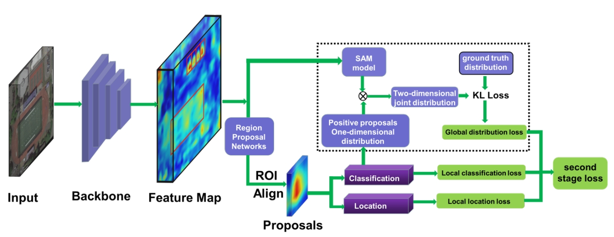
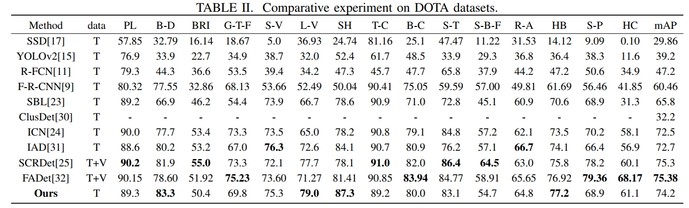
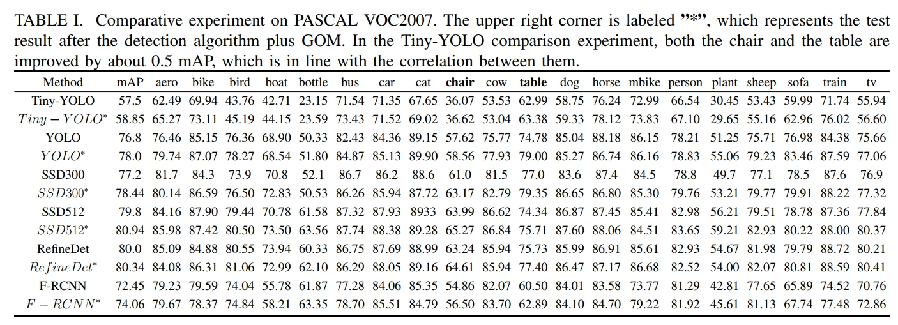

# Satellite Remote Sensing Image Object Detection

This project is about detecting objects in satellite remote sensing images using RefineDet with PyTorch.

## Framework
<div align=center>   </div> 

## Author
- YPW
- Email: 1043773117@qq.com

## Requirements

- Python 3
- PyTorch 0.4 or higher
- torchvision
- visdom
- numpy

## Dataset
DOTA dataset is a large-scale dataset for object detection in aerial images, containing images from different sensors and platforms. Each image has a pixel size ranging from 800 × 800 to 20,000 × 20,000, and contains objects with various sizes, orientations, and shapes. The dataset has 18 common categories, such as boat, car, plane, etc. You can extend this demo to include more categories or use other models.
 
## Usage

### Training

To train the model, run the following command:

```bash
python train.py --dataset VOC --dataset_root *
```

You can also use other arguments to customize the training process, such as --resume to resume from a checkpoint, --visdom to use visdom for loss visualization, and --save_frequency to set the frequency of saving checkpoints.

# Testing
To test the model, run the following command:

python test.py --dataset VOC --dataset_root * --trained_model pretrain/*.pth

You can also use other arguments to customize the testing process, such as --cuda to use CUDA for acceleration, and --voc_root to set the root directory of VOC dataset.

# Results
The model achieves a mean average precision (mAP) of 74.2% on DOTA test set.
<div align=center>   </div> 

<div align=center>   </div> 

##  Demo
 
<div align=center>   </div> 